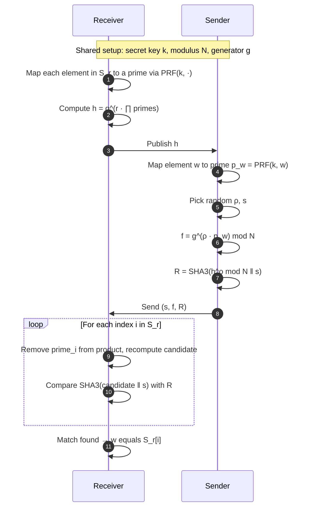

# Project_PCI

**A Python implementation of a Private Set Intersection (PSI) / Private Set Membership (PSM) cryptographic protocol.**

Developed as a **Cybersecurity (CySec) course project** at Saarland University (2020). The protocol lets two parties discover whether their datasets share common elements **without revealing non-matching items**.

---

## Table of Contents

- [Overview](#overview)
- [Problem Statement](#problem-statement)
- [How It Works](#how-it-works)
- [Cryptographic Building Blocks](#cryptographic-building-blocks)
- [Project Structure](#project-structure)
- [Requirements](#requirements)
- [Installation](#installation)
- [Usage](#usage)
- [Example Session](#example-session)
- [API Reference](#api-reference)
- [Security Model & Limitations](#security-model--limitations)
- [Related Work](#related-work)
- [Contributors](#contributors)

---

## Overview

| | |
|---|---|
| **Language** | Python 3 |
| **Domain** | Cryptographic protocols, privacy-preserving computation |
| **Protocol type** | Private Set Membership (PSM) — a single-element variant of PSI |
| **Parties** | **Receiver** (holds a large private set) and **Sender** (queries with one or more elements) |
| **Primitives** | HMAC-SHA256 PRF, modular exponentiation, SHA3-256 extractor |

This repository implements a research-paper-style security protocol in four modules: shared utilities, a Receiver, a Sender, and an interactive driver script.

---

## Problem Statement

Two parties each hold a set of integers:

- **Receiver** holds set `S_r` (in this demo: 200 random integers, fixed for all users).
- **Sender** holds set `S_s` (entered interactively by each user).

They want to learn **which sender elements appear in the receiver's set** while:

1. Not exposing elements that are **not** in the intersection.
2. Using cryptography (PRF + modular arithmetic + hashing) instead of plaintext comparison.

> **Real-world use cases:** contact discovery (Signal), fraud detection, intelligence sharing, collaborative malware analysis, and any scenario where two organizations need overlap without full data disclosure.

---

## How It Works

### High-level flow



### Mathematical intuition

Both parties share a secret key `k`. Each set element `x` is mapped to a distinct large prime:

```
p_x = next_prime( HMAC-SHA256(k, x) )
```

**Receiver** (set `S_r = {s_1, …, s_n}`):

1. Draw random `r`.
2. Compute blinded commitment:
   ```
   h = g^(r · p_{s_1} · p_{s_2} · … · p_{s_n})  mod N
   ```

**Sender** (single element `w`):

1. Draw random `ρ` and `s`.
2. Send:
   ```
   f = g^(ρ · p_w)           mod N
   R = SHA3( h^ρ mod N  ‖  s )
   ```

**Intersection test** — for each index `i`, the receiver removes `p_{s_i}` from the exponent product and checks whether the resulting value produces the same hash `R`:

```
If w = s_i  →  secArg = h^ρ  →  SHA3(secArg ‖ s) = R   ✓ intersection at index i
If w ≠ s_i  →  secArg is pseudorandom  →  hash mismatch
```

### Protocol diagram

```
┌─────────────────────────────────────────────────────────────────┐
│                        SETUP (per query)                        │
│  N = p × q   (RSA-style composite modulus)                      │
│  g ← random unit mod N                                          │
│  k ← shared secret key                                          │
└─────────────────────────────────────────────────────────────────┘
                              │
          ┌───────────────────┴───────────────────┐
          ▼                                       ▼
   ┌──────────────┐                      ┌──────────────┐
   │   RECEIVER   │                      │    SENDER    │
   │  set S_r     │                      │  element w   │
   └──────┬───────┘                      └──────┬───────┘
          │  PRF(k, S_r) → primes                 │  PRF(k, w) → p_w
          │  h = g^(r·∏primes)                    │  f = g^(ρ·p_w)
          │──────────────── h ──────────────────►│  R = SHA3(h^ρ ‖ s)
          │◄──────────── (s, f, R) ──────────────│
          │  check each index i                   │
          │  print match if found                 │
          └───────────────────────────────────────┘
```

---

## Cryptographic Building Blocks

| Component | Implementation | Purpose |
|-----------|----------------|---------|
| **PRF** | `HMAC-SHA256(secretKey, element)` → `nextprime()` | Deterministic, keyed mapping from set elements to large primes |
| **Modulus** | `N = p × q` (fixed 64-bit primes in `Run_Protocol.py`) | Group for modular exponentiation |
| **Generator** | `findGenerator(N)` — random `g` with `gcd(g, N) = 1` | Base for exponentiation |
| **Blinding** | Random `r` (receiver), `ρ` (sender) | Hide raw set values during transmission |
| **Extractor** | `SHA3-256(value ‖ s)` | Commitment-style equality check without revealing `h^ρ` directly |

### PRF definition (`utils.py`)

```python
def prf(secretKey, elementsSet):
    # For each element x:
    #   digest = HMAC-SHA256(key, str(x))
    #   p_x    = next_prime(int(digest, 16))
```

---

## Project Structure

```
Project_PCI/
├── Run_Protocol.py   # Entry point — interactive multi-user driver
├── Receiver.py       # Receiver party: builds h, checks intersection
├── Sender.py         # Sender party: computes (s, f, R) for one element
├── utils.py          # PRF, randomness, GCD, generator selection
└── README.md
```

| File | Responsibility |
|------|----------------|
| `Run_Protocol.py` | Generates receiver set `rein`, prompts for users, runs `protocol()` per sender element |
| `Receiver.py` | `hashReceiver()` publishes `h`; `checkIntersection()` tests each index |
| `Sender.py` | `computeSender()` returns `[s, f, Ext]` for element `w` |
| `utils.py` | Cryptographic helpers shared by both parties |

---

## Requirements

- **Python** 3.8+
- **sympy** — `nextprime()` for PRF output
- **pycryptodome** — `HMAC` / `SHA256` for the PRF

---

## Installation

```bash
# Clone the repository
git clone https://github.com/osama11osama/Project_sch.git
cd Project_sch

# Install dependencies
pip install sympy pycryptodome
```

---

## Usage

Run the interactive protocol from the project root:

```bash
python Run_Protocol.py
```

### Interactive prompts

1. The program prints the **receiver's private set** (`rein`) — 200 random integers in `[2, 999]`.
2. Enter the **number of users** (senders).
3. For each user, enter a **space-separated list of integers** to test against the receiver set.

### Programmatic usage

```python
from Receiver import Receiver
from Sender import Sender
from utils import findGenerator, getRandom

p = 12009342892403487151
q = 16745092048479459697
N = p * q
g = findGenerator(N)

Sr = [13, 3, 5, 99]   # Receiver set
w  = 5                 # Sender element to test

sKey = getRandom(200)
receiver = Receiver(sKey, g, N, Sr)
h = receiver.hashReceiver()

sender = Sender(sKey, N, g, w, h)
s, f, R = sender.computeSender()
receiver.checkIntersection(s, f, R)
# Output: There is an intersection with index: 2
```

---

## Example Session

```
$ python Run_Protocol.py

[341, 127, 503, ...]          # Receiver set (200 values)

Enter users number:
2

user 1 give your set:
13 3 500
N is 2009... p is 12009... q is 16745... g is 847...
There is an intersection with index: 41
There is an intersection with index: 17

user 2 give your set:
999 888
N is 2009... ...
# No output → no intersection found
```

---

## API Reference

### `Receiver(secretKey, g, N, Sr)`

| Method | Returns | Description |
|--------|---------|-------------|
| `hashReceiver()` | `h` | Blinded commitment over the full receiver set |
| `checkIntersection(s, f, R)` | — | Tests each index; prints on match |

### `Sender(secretKey, N, g, w, h)`

| Method | Returns | Description |
|--------|---------|-------------|
| `computeSender()` | `[s, f, Ext]` | Random `s`, masked `f`, and hash commitment `Ext` |

### `utils.py`

| Function | Description |
|----------|-------------|
| `prf(secretKey, elementsSet)` | Map elements to primes via HMAC + `nextprime` |
| `findGenerator(N)` | Find `g` coprime to `N` |
| `getRandom(seed)` | Uniform random integer in `[1, seed]` |
| `gcd(a, b)` | Greatest common divisor |

---

## Security Model & Limitations

### Assumed model

- **Semi-honest (honest-but-curious):** parties follow the protocol but may try to infer extra information from messages.
- **Shared secret key:** `sKey` must be established securely before the protocol runs (in the demo it is sampled locally per query).

### Privacy goals (design intent)

| Party | Should learn | Should not learn |
|-------|--------------|------------------|
| Sender | Whether `w ∈ S_r` (implicit via receiver output) | Other elements of `S_r` |
| Receiver | Index of matching element | Sender's non-matching elements (beyond failed tests) |

### Known limitations (educational prototype)

> ⚠️ **Not production-ready.** This is a course implementation for learning and demonstration.

- **Small modulus** — fixed 64-bit primes; no realistic security level.
- **Generator selection** — `findGenerator` only checks `gcd(g, N) = 1`, not full subgroup generation.
- **No network layer** — parties run in the same process; no TLS or authentication.
- **No malicious security** — no zero-knowledge proofs, commitments, or input validation.
- **Receiver learns index** — matching index may leak information if the domain is small.
- **Per-element sessions** — a fresh `sKey` and `Receiver` instance are created for each sender element in `Run_Protocol.py`.

---

## Related Work

This protocol belongs to the **Private Set Intersection (PSI)** family. Conceptually related papers include:

| Paper | Authors | Relevance |
|-------|---------|-----------|
| *Efficient Private Matching and Set Intersection* | Freedman, Nissim, Pinkas (EUROCRYPT 2004) | Foundational PSI using polynomial roots |
| *Practical Private Set Intersection Protocols with Linear Complexity* | De Cristofaro, Tsudik (FC 2010) | Linear-complexity PSI with modular exponentiation |
| *Keyword Search and Oblivious Pseudorandom Functions* | Freedman, Ishai, Pinkas, Reingold | OPRF-based PSI building blocks |
| *A More Efficient Cryptographic Matchmaking Protocol* | Meadows (1986) | Early DH-based private matching |

The **PRF-to-prime + product-exponentiation** construction in this project is a simplified, teaching-oriented variant rather than a direct copy of any single published protocol.

---

## Contributors

| Contributor | Role |
|-------------|------|
| Abdullah Malallah | Core protocol implementation (Uni Saarland) |
| Osama | Integration, testing, repository maintenance |

**Timeline:** Initial prototype — December 2020 · CySec course project

---

## License

Academic / educational use. See repository history for authorship details.

---

<p align="center">
  <sub>Built for privacy-preserving set intersection — CySec Project, 2020</sub>
</p>
